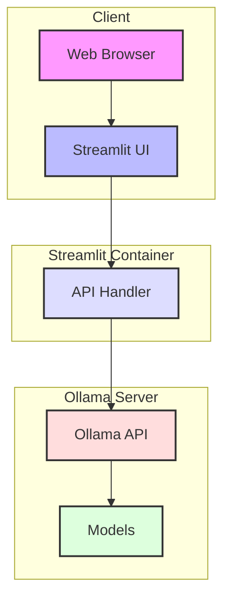

# Ollama Dashboard

An elegant, Apple-inspired dark mode Streamlit dashboard for interacting with Ollama models.


## Features

- **Elegant Apple-inspired Dark Mode UI**: Beautiful user interface with subtle gradients, rounded corners, and Apple-like aesthetics
- **Model Management**: Pull, delete, and view model details
- **Model Interaction**: Chat with your models through an intuitive interface
- **Server Monitoring**: View server status and model statistics
- **Responsive Design**: Optimized for desktop, tablet, and mobile devices

## Installation

### Option 1: Direct Installation

1. Clone this repository:
   ```bash
   git clone https://github.com/yourusername/streamlit-ollama-ui.git
   cd streamlit-ollama-ui
   ```

2. Install the required packages:
   ```bash
   pip install -r requirements.txt
   ```

3. Make sure your Ollama server is running:
   ```bash
   ollama serve
   ```

4. Run the Streamlit app:
   ```bash
   streamlit run app.py
   ```

### Option 2: Docker Installation

1. Clone this repository:
   ```bash
   git clone https://github.com/yourusername/streamlit-ollama-ui.git
   cd streamlit-ollama-ui
   ```

2. Build and run using Docker Compose:
   ```bash
   docker-compose up -d
   ```

   This will build the Docker image and start the container in detached mode.

3. Access the dashboard at `http://localhost:8501`

4. Configure the connection to your Ollama server through the UI:
   - In the sidebar, enter the URL of your Ollama server (e.g., `http://localhost:11434` for local server)
   - Click "Test Connection" to verify it's working

#### Docker Compose Configuration

The included `docker-compose.yml` file is pre-configured to:
- Map port 8501 for the Streamlit interface
- Persist configuration in a volume
- Run in a containerized environment separate from your Ollama server

The configuration is intentionally minimal to support flexible deployment scenarios:
- You can run the container on the same host as Ollama
- You can run the container on a different host and connect to a remote Ollama server
- All connection configuration is handled through the UI, not environment variables

## Architecture



## Usage Guide

### Dashboard Sections

#### 1. Overview
The main dashboard provides:
- A summary of all available models
- Quick actions for model management:
  - Load models into VRAM with customizable keep-alive durations
  - Unload models directly from the dashboard
  - Delete models with confirmation protection

#### 2. Model Management
Provides detailed model management capabilities:
- **Pull New Models**: Download models from the Ollama library with progress tracking
- **Manage Existing Models**: Load, unload, and delete models with detailed options
- **Model Details**: View technical information about your models

#### 3. Chat with Models
Interactive chat interface to:
- Select any loaded model
- Configure inference parameters
- Save and load chat history

#### 4. Server Status
Monitor your Ollama server:
- View system metrics
- Check model usage statistics
- Monitor API performance

### Configuration Options

You can configure the dashboard by modifying:
- Default server URL in app.py
- UI preferences in utils/styling.py
- Model presets in utils/presets.py

## Troubleshooting

### Common Issues

1. **Connection Failed**
   - Ensure Ollama server is running
   - Check the server URL in the sidebar configuration
   - Verify network connectivity

2. **Docker Connection Issues**
   - When running in Docker, ensure the `OLLAMA_API_HOST` is correctly set
   - For local Ollama, use `host.docker.internal` as the host

3. **UI Rendering Issues**
   - Clear browser cache
   - Try a different browser
   - Update Streamlit to the latest version

## Contributing

Contributions are welcome! Please feel free to submit a Pull Request.

## License

[MIT License](LICENSE)

## Acknowledgements

- Built with [Streamlit](https://streamlit.io/)
- Interacts with [Ollama](https://ollama.ai/)
- Apple-inspired UI design

## Project Structure

```
streamlit-ollama-ui/
├── app.py                  # Main application entry point
├── components/
│   ├── model_interaction.py # Model chatting interface
│   ├── model_management.py  # Model management functionality
│   ├── overview.py          # Dashboard overview page
│   ├── server_status.py     # Server monitoring page
│   └── sidebar.py           # Navigation sidebar
├── utils/
│   ├── api_handler.py       # Ollama API interactions
│   └── styling.py           # Custom styling for Apple aesthetics
├── assets/                  # Static assets (if needed)
└── requirements.txt         # Python dependencies
```

## Customization

The UI is built with a custom dark theme inspired by Apple's design language. You can adjust the styling by modifying the `utils/styling.py` file.
